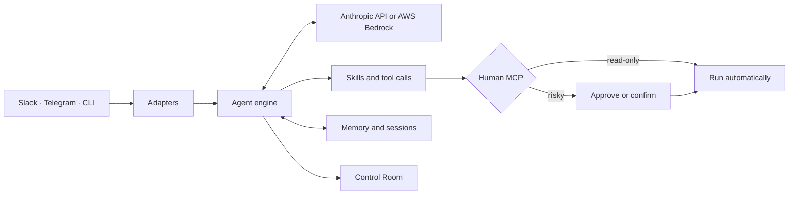

<div align="center">
  <picture>
    <source media="(prefers-color-scheme: dark)" srcset="docs-site/src/assets/logo-dark.svg">
    <source media="(prefers-color-scheme: light)" srcset="docs-site/src/assets/logo-light.svg">
    
  </picture>

  <p><strong>A multiplayer agent harness for your organization.</strong></p>

  <p>
    <a href="https://github.com/last9/mithai/actions/workflows/ci.yml"></a>
    <a href="https://pypi.org/project/mithai/"></a>
    
    <a href="LICENSE"></a>
  </p>

  <p>
    <a href="https://docs.mithai.dev">Documentation</a> ·
    <a href="#quick-start">Quick start</a> ·
    <a href="#create-a-skill">Create a skill</a> ·
    <a href="CONTRIBUTING.md">Contributing</a>
  </p>
</div>

mithai runs one agent for a group of people. Put it in Slack or Telegram, or use it from a terminal. These aren't separate agents. They load the same project, skills and shared memory.

mithai is aimed mostly at infrastructure work. It can inspect systems and call tools. Scheduling is there for work it needs to come back to. For commands you don't want running unattended, there are approvals and typed confirmations.

## Multiplayer

An incident might start in Slack and continue from a terminal. A teammate can look up what happened in Control Room or search an earlier session. Shared memory carries the things the agent should remember; the conversations themselves stay as separate session records.

The Slack, Telegram and CLI adapters can all run at once. An approval request goes back to the place where the command was asked for. Skills belong to the project rather than one user; they are folders with instructions and, if needed, Python tools.

Anthropic is the default model provider. Bedrock works too.

## Quick start

Start in the terminal. `mithai init` walks through the initial config:

```bash
python -m pip install mithai
mithai init

# Add ANTHROPIC_API_KEY to the generated .env file
mithai chat
```

Once that works, start the Slack or Telegram adapters from the same project:

```bash
mithai run
```

The base package is small. Install the extras you plan to use:

| Use case | Install |
| --- | --- |
| Slack | `pip install 'mithai[slack]'` |
| Telegram | `pip install 'mithai[telegram]'` |
| Control Room | `pip install 'mithai[ui]'` |
| AWS Bedrock | `pip install 'mithai[bedrock]'` |
| OpenTelemetry and Last9 enrichment | `pip install 'mithai[telemetry]'` |

There is a longer walkthrough in [Getting started](docs/getting-started.md).

## Control Room

Control Room is a small web UI included with mithai. It reads from the agent's existing state and memory, so there isn't another store to configure. Use it to look through sessions, pending approvals, memory, loaded skills and the current config.

```bash
pip install 'mithai[ui]'
mithai ui
# Open http://127.0.0.1:8420
```

<p align="center">
  
</p>

<p align="center"><sub>The screenshot uses made-up local session and approval data.</sub></p>

It binds to localhost by default. Set `ui.auth_token` before exposing it anywhere else. The options are in the [configuration reference](docs/configuration.md).

## How it works



All three adapters feed the same engine. The adapter normalizes the incoming message, then the engine sends the model the relevant conversation and available skills. Tool calls go through the Human MCP policy before they run. The reply and tool activity are saved for the next turn.

## Built-in skills

| Skill | What it does | Default human policy |
| --- | --- | --- |
| `http_checker` | Check URL health, status codes, and response times | automatic |
| `kubernetes` | Inspect pods, deployments, events, logs, and resources | automatic |
| `memory` | Read, write, and search persistent operational memory | automatic |
| `scheduling` | Create and remove recurring tasks | confirmation |
| `sessions` | Inspect and search previous conversations | automatic |
| `shell` | Run commands from the configured allowlist | dynamic |

## Create a skill

Skills live in folders. Start one with:

```bash
mithai skill create uptime
```

The command makes `skills/uptime/SKILL.md` and `skills/uptime/tools.py`.

Put the instructions in `SKILL.md`:

```markdown
---
name: uptime
description: Check the health of HTTP endpoints.
---

Check endpoint availability and report status codes and response times.
```

If the skill needs its own tool, add it in `tools.py`:

```python
import json
from urllib.request import urlopen

TOOLS = [
    {
        "name": "check_url",
        "description": "Check whether an HTTP endpoint is reachable",
        "input_schema": {
            "type": "object",
            "properties": {"url": {"type": "string"}},
            "required": ["url"],
        },
    }
]


def handle(name: str, input: dict, ctx: dict) -> str:
    if name != "check_url":
        return json.dumps({"error": f"Unknown tool: {name}"})
    with urlopen(input["url"], timeout=10) as response:
        return json.dumps({"status": response.status, "healthy": response.status < 500})
```

`tools.py` is optional. A skill can just contain instructions, including instructions for MCP tools supplied somewhere else. Check it before loading:

```bash
mithai skill validate uptime
```

The [skills reference](docs/skills-reference.md) covers the rest of the format, lifecycle hooks, config and packaging.

## Human approval policies

Tools don't all need the same amount of supervision. A read can run directly while a restart or delete waits for someone:

| Policy | Behavior |
| --- | --- |
| no policy | Execute automatically |
| `approve` | Ask a human to approve or deny |
| `confirm` | Require typed confirmation |
| `dynamic` | Resolve the policy from the requested input |

```python
TOOLS = [
    {"name": "get_pods", "description": "List pods", "input_schema": {}},
    {
        "name": "restart_deployment",
        "description": "Restart a deployment",
        "input_schema": {"type": "object"},
        "human": "approve",
    },
]
```

You can tighten those rules in `config.yaml` without editing the skill:

```yaml
human:
  timeout_seconds: 300
  overrides:
    shell__run_command: confirm
    kubernetes__get_pods: null
```

## Minimal configuration

`mithai init` writes this for you. Here is a trimmed example:

```yaml
bot:
  name: mithai

adapter:
  type: slack
  slack:
    bot_token: ${SLACK_BOT_TOKEN}
    app_token: ${SLACK_APP_TOKEN}

llm:
  provider: anthropic
  model: claude-sonnet-4-6
  anthropic:
    api_key: ${ANTHROPIC_API_KEY}

skills:
  paths:
    - ./skills
  config:
    shell:
      allowed_commands: ["df -h", "uptime"]
```

Use `adapter.types` instead of `adapter.type` when you want several adapters running at once. They still share one engine and set of skills. Approval requests go back to the platform where the request started.

## Other parts of mithai

Scheduling can use local cron, or a central backend if jobs need to survive restarts and move between hosts. Slack onboarding reads a channel's members and recent history, then folds what it learns into shared memory.

There is also a multi-agent mode. Each agent can have its own name, skills, Slack app and memory, while staying in the same project:

```bash
mithai agent create devops --name "DevOps Agent" --skills shell,memory,http_checker
```

OpenTelemetry export is optional. Last9 GenAI span enrichment is available with the telemetry extra.

## Advanced usage

### AWS Bedrock

Bedrock is an optional install:

```bash
pip install 'mithai[bedrock]'
```

```yaml
llm:
  provider: bedrock
  model: anthropic.claude-sonnet-4-20250514-v1:0
  max_tokens: 4096
  bedrock:
    access_key_id: ${AWS_ACCESS_KEY_ID}
    secret_access_key: ${AWS_SECRET_ACCESS_KEY}
    region: ${AWS_REGION}
    session_token: ${AWS_SESSION_TOKEN} # optional for temporary credentials
```

The `model` value is a Bedrock model ID, not an Anthropic alias. The IAM principal needs `bedrock:InvokeModel` for every model the agent will use. More model and credential examples are in [Configuration: LLM providers](docs/configuration.md#llm).

### CLI reference

| Command | Purpose |
| --- | --- |
| `mithai init` | Create a project and interactive configuration |
| `mithai chat` | Run an interactive terminal session |
| `mithai run` | Start configured adapters and agents |
| `mithai ui` | Start the local Control Room |
| `mithai doctor` / `mithai status` | Diagnose configuration and inspect runtime status |
| `mithai logs` | List, search, and inspect session logs |
| `mithai skill` | Create, install, list, validate, upgrade, or remove skills |
| `mithai agent` | Create, list, inspect, or validate agents |
| `mithai service` | Manage mithai as an operating-system service |

Use `mithai --help` or `mithai <command> --help` for the flags and subcommands.

## Documentation

| Guide | Covers |
| --- | --- |
| [Getting started](docs/getting-started.md) | Installation, initialization, and first run |
| [Configuration](docs/configuration.md) | Adapters, providers, state, memory, and policy |
| [Core concepts](docs/concepts.md) | Engine, skills, sessions, memory, and Human MCP |
| [Skills reference](docs/skills-reference.md) | Skill files, exports, lifecycle, and validation |
| [Deployment](docs/deployment.md) | Services, containers, Kubernetes, and production setup |
| [Security](docs/security.md) | Secrets, permissions, network exposure, and operational safety |
| [Troubleshooting](docs/troubleshooting.md) | Common setup and runtime problems |

The same documentation is rendered at [docs.mithai.dev](https://docs.mithai.dev).

## Development

```bash
git clone https://github.com/last9/mithai.git
cd mithai
uv sync --all-extras

uv run ruff check src/ tests/
uv run pytest tests/

python3 docs-site/migrate.py
cd docs-site && npm ci --legacy-peer-deps && npm run build
```

See [CONTRIBUTING.md](CONTRIBUTING.md) before opening a pull request.

## License

Apache 2.0. See [LICENSE](LICENSE).
