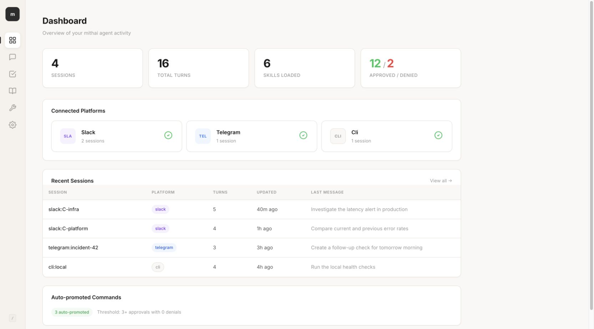
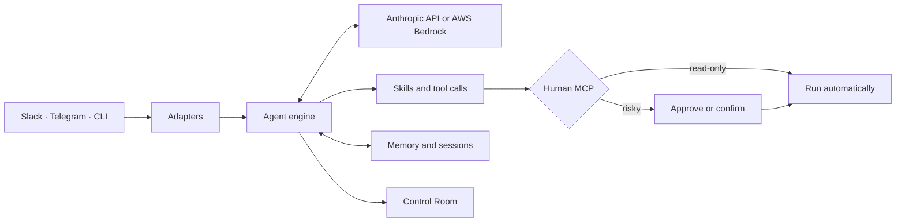

<div align="center">
  <picture>
    <source media="(prefers-color-scheme: dark)" srcset="docs-site/src/assets/logo-dark.svg">
    <source media="(prefers-color-scheme: light)" srcset="docs-site/src/assets/logo-light.svg">
    
  </picture>

  <p><strong>A multiplayer agent harness for your organization.</strong></p>

  <p>
    <a href="https://github.com/last9/mithai/actions/workflows/ci.yml"></a>
    <a href="https://pypi.org/project/mithai/"></a>
    
    <a href="LICENSE"></a>
  </p>

  <p>
    <a href="https://docs.mithai.dev">Documentation</a> ·
    <a href="#quick-start">Quick start</a> ·
    <a href="#create-a-skill">Create a skill</a> ·
    <a href="CONTRIBUTING.md">Contributing</a>
  </p>
</div>

mithai gives organizations a multiplayer agent harness for infrastructure operations: one shared agent that teammates can work with across Slack, Telegram, and the terminal. It investigates systems, uses tools, carries operational context across conversations, schedules follow-ups, and pauses for human approval before risky actions.

## Why mithai

| Capability | What it gives you |
| --- | --- |
| **Multiplayer by default** | Teammates collaborate with one shared agent across Slack, Telegram, and the CLI, with common skills and context. |
| **Human-in-the-loop by design** | Read-only tools can run automatically; risky tools can require approval or typed confirmation. |
| **Skills, not a closed toolset** | Add a folder with instructions and optional Python tools. Restart, and the agent can use it. |
| **Shared operational context** | Persist memory and conversation sessions across channels and restarts. |
| **Model choice** | Use Anthropic directly or models available through AWS Bedrock. |
| **A built-in Control Room** | Inspect sessions, approvals, memory, skills, and redacted configuration in a local web UI. |

## Quick start

Install mithai, let the setup wizard create your config, and start with the local chat interface:

```bash
python -m pip install mithai
mithai init

# Add ANTHROPIC_API_KEY to the generated .env file
mithai chat
```

When the agent is ready for Slack or Telegram, start the configured adapters with:

```bash
mithai run
```

Install only the integrations you need:

| Use case | Install |
| --- | --- |
| Slack | `pip install 'mithai[slack]'` |
| Telegram | `pip install 'mithai[telegram]'` |
| Control Room | `pip install 'mithai[ui]'` |
| AWS Bedrock | `pip install 'mithai[bedrock]'` |
| OpenTelemetry and Last9 enrichment | `pip install 'mithai[telemetry]'` |

For a guided setup, see [Getting started](docs/getting-started.md).

## Control Room

The Control Room is a lightweight UI over the same state and memory backends used by the agent. It gives operators a searchable view of activity without introducing a second data store.

```bash
pip install 'mithai[ui]'
mithai ui
# Open http://127.0.0.1:8420
```

<p align="center">
  
</p>

<p align="center"><sub>Control Room shown with illustrative local session and approval data.</sub></p>

By default, the UI binds to localhost. Public binding requires `ui.auth_token`; see the [configuration reference](docs/configuration.md).

## How it works



1. An adapter turns a Slack mention, Telegram message, or CLI prompt into a common request.
2. The engine gives the model the conversation context and available skills.
3. Tool calls are routed through Human MCP policy before execution.
4. The response, tool activity, and useful context are persisted for the next interaction.

## Built-in skills

| Skill | What it does | Default human policy |
| --- | --- | --- |
| `http_checker` | Check URL health, status codes, and response times | automatic |
| `kubernetes` | Inspect pods, deployments, events, logs, and resources | automatic |
| `memory` | Read, write, and search persistent operational memory | automatic |
| `scheduling` | Create and remove recurring tasks | confirmation |
| `sessions` | Inspect and search previous conversations | automatic |
| `shell` | Run commands from the configured allowlist | dynamic |

## Create a skill

Scaffold a skill with the CLI:

```bash
mithai skill create uptime
```

This creates `skills/uptime/SKILL.md` and `skills/uptime/tools.py`.

`SKILL.md` tells the model when and how to use the skill:

```markdown
---
name: uptime
description: Check the health of HTTP endpoints.
---

Check endpoint availability and report status codes and response times.
```

`tools.py` exposes native tools when the skill needs them:

```python
import json
from urllib.request import urlopen

TOOLS = [
    {
        "name": "check_url",
        "description": "Check whether an HTTP endpoint is reachable",
        "input_schema": {
            "type": "object",
            "properties": {"url": {"type": "string"}},
            "required": ["url"],
        },
    }
]


def handle(name: str, input: dict, ctx: dict) -> str:
    if name != "check_url":
        return json.dumps({"error": f"Unknown tool: {name}"})
    with urlopen(input["url"], timeout=10) as response:
        return json.dumps({"status": response.status, "healthy": response.status < 500})
```

`tools.py` is optional, so a skill can also be instructions-only and guide the model toward MCP tools supplied elsewhere. Validate a skill before loading it:

```bash
mithai skill validate uptime
```

See the [skills reference](docs/skills-reference.md) for the full contract, lifecycle hooks, configuration, and packaging behavior.

## Human approval policies

Every tool can declare the level of human involvement it needs:

| Policy | Behavior |
| --- | --- |
| no policy | Execute automatically |
| `approve` | Ask a human to approve or deny |
| `confirm` | Require typed confirmation |
| `dynamic` | Resolve the policy from the requested input |

```python
TOOLS = [
    {"name": "get_pods", "description": "List pods", "input_schema": {}},
    {
        "name": "restart_deployment",
        "description": "Restart a deployment",
        "input_schema": {"type": "object"},
        "human": "approve",
    },
]
```

Administrators can make policy stricter in `config.yaml` without changing skill code:

```yaml
human:
  timeout_seconds: 300
  overrides:
    shell__run_command: confirm
    kubernetes__get_pods: null
```

## Minimal configuration

`mithai init` generates a working project. The central pieces look like this:

```yaml
bot:
  name: mithai

adapter:
  type: slack
  slack:
    bot_token: ${SLACK_BOT_TOKEN}
    app_token: ${SLACK_APP_TOKEN}

llm:
  provider: anthropic
  model: claude-sonnet-4-6
  anthropic:
    api_key: ${ANTHROPIC_API_KEY}

skills:
  paths:
    - ./skills
  config:
    shell:
      allowed_commands: ["df -h", "uptime"]
```

Use `adapter.types` instead of `adapter.type` to run multiple adapters simultaneously. They share the engine, skills, and context while approval requests return through the platform that initiated the action.

## More capabilities

- **Scheduling:** recurring local cron tasks or a central scheduling backend that survives restarts.
- **Onboarding:** learn a Slack channel's purpose and members, merge useful facts into shared memory, and introduce the agent.
- **Multi-agent mode:** give separate agents their own identity, skills, Slack app, and memory while managing them from one project.
- **Observability:** export OpenTelemetry data and optionally enrich GenAI spans for Last9.

Create a specialized agent with:

```bash
mithai agent create devops --name "DevOps Agent" --skills shell,memory,http_checker
```

## Advanced usage

### AWS Bedrock

Install the provider extra, then select `bedrock` and use a Bedrock model ID rather than an Anthropic model alias:

```bash
pip install 'mithai[bedrock]'
```

```yaml
llm:
  provider: bedrock
  model: anthropic.claude-sonnet-4-20250514-v1:0
  max_tokens: 4096
  bedrock:
    access_key_id: ${AWS_ACCESS_KEY_ID}
    secret_access_key: ${AWS_SECRET_ACCESS_KEY}
    region: ${AWS_REGION}
    session_token: ${AWS_SESSION_TOKEN} # optional for temporary credentials
```

The configured IAM principal needs `bedrock:InvokeModel` permission for each model the agent uses. See [Configuration: LLM providers](docs/configuration.md#llm) for model examples and credential details.

### CLI reference

| Command | Purpose |
| --- | --- |
| `mithai init` | Create a project and interactive configuration |
| `mithai chat` | Run an interactive terminal session |
| `mithai run` | Start configured adapters and agents |
| `mithai ui` | Start the local Control Room |
| `mithai doctor` / `mithai status` | Diagnose configuration and inspect runtime status |
| `mithai logs` | List, search, and inspect session logs |
| `mithai skill` | Create, install, list, validate, upgrade, or remove skills |
| `mithai agent` | Create, list, inspect, or validate agents |
| `mithai service` | Manage mithai as an operating-system service |

Run `mithai --help` or `mithai <command> --help` for all options and subcommands.

## Documentation

| Guide | Covers |
| --- | --- |
| [Getting started](docs/getting-started.md) | Installation, initialization, and first run |
| [Configuration](docs/configuration.md) | Adapters, providers, state, memory, and policy |
| [Core concepts](docs/concepts.md) | Engine, skills, sessions, memory, and Human MCP |
| [Skills reference](docs/skills-reference.md) | Skill files, exports, lifecycle, and validation |
| [Deployment](docs/deployment.md) | Services, containers, Kubernetes, and production setup |
| [Security](docs/security.md) | Secrets, permissions, network exposure, and operational safety |
| [Troubleshooting](docs/troubleshooting.md) | Common setup and runtime problems |

The rendered documentation is available at [docs.mithai.dev](https://docs.mithai.dev).

## Development

```bash
git clone https://github.com/last9/mithai.git
cd mithai
uv sync --all-extras

uv run ruff check src/ tests/
uv run pytest tests/

python3 docs-site/migrate.py
cd docs-site && npm ci --legacy-peer-deps && npm run build
```

See [CONTRIBUTING.md](CONTRIBUTING.md) before opening a pull request.

## License

Apache 2.0. See [LICENSE](LICENSE).
